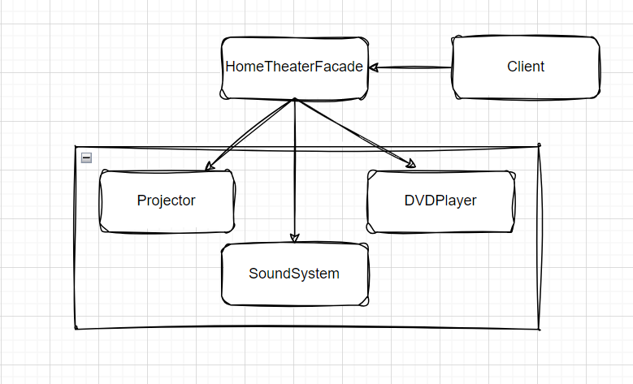

# FacadeDesignPattern
A Facade is a design pattern that provides a simple interface to a complex system. It creates a single class that hides the detailed workings of the system, making it easier for clients to interact with it. The Facade only exposes the features that clients need, simplifying the integration and use of complex libraries or subsystems.

## Project Structure

1. **HomeTheaterFacade:** The facade class that provides a simple interface to control the home theater system.
2. **Projector:** Represents the projector component of the home theater system.
3. **SoundSystem:** Represents the sound system component of the home theater system.
4. **DVDPlayer:** Represents the DVD player component of the home theater system.
5. **Program:** The client class that interacts with the HomeTheaterFacade to control the home theater system.

This project implements a home theater management system using the Facade design pattern, simplifying the control of components like the projector, sound system, and DVD player through a single interface. It includes unit testing with mock objects to ensure correct behavior.

### Environment

The project builds and runs with Visual Studio Community 2022 when the required workloads are installed.

